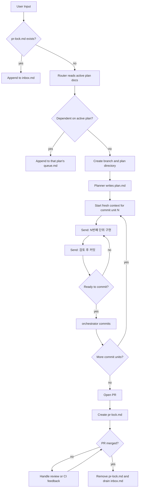

# Codex Workflow Orchestrator Design

## 목표

사용자 요청을 Codex 기반 작업 흐름으로 라우팅하고, 구현 계획을 커밋 단위로 나누어 순차 실행한 뒤, PR 생성과 심사 상태까지 관리하는 작은 orchestrator를 만든다.

이 시스템의 핵심은 Agent를 복잡한 영구 프로세스로 나누는 것이 아니라, 하나의 orchestrator가 상태 머신을 관리하고 Codex CLI session에 역할별 prompt를 전달하는 방식이다.

## 설계 원칙

- 상태의 source of truth는 Markdown 문서로 둔다.
- JSON plan이나 큰 JSON schema는 사용하지 않는다.
- LLM이 작성하는 계획 문서는 과하게 규격화하지 않는다.
- CLI stdout을 복잡하게 파싱하지 않는다.
- 대시보드는 Markdown state를 읽기만 하며 plan, queue, log를 수정하거나 상태 전환을 실행하지 않는다.
- 상태 전환 결정은 짧은 final response로 받고, 필요할 때만 작은 `--output-schema`를 사용한다.
- 상세한 계획, 이유, 구현 메모, Queue는 Markdown으로 남긴다.
- orchestrator는 Markdown을 세밀하게 파싱하기보다, git 상태, CLI exit status, 작은 결정 결과를 기준으로 흐름을 전환한다.

## 기본 디렉터리 구조

```text
.crack/
  inbox.md
  pr-lock.md
  plans/
    codex-feature-name/
      plan.md
      queue.md
      log.md
```

### `inbox.md`

PR 심사 중이거나 새 Plan 생성을 멈춰야 하는 상황에서 들어온 사용자 요청을 순서대로 쌓는다.

### `pr-lock.md`

이 파일이 존재하면 새 Plan 생성을 중단한다.

예시:

```md
# PR Lock

Branch: codex/feature-name
PR: https://github.com/example/repo/pull/123
Status: reviewing

While this file exists, new user requests are appended to inbox.md.
```

### `plans/<branch-name>/plan.md`

LLM이 자유롭게 작성하는 구현 계획 문서다.

최소 관례는 다음 정도만 둔다.

```md
# Plan: Feature Name

Branch: codex/feature-name

## Intent

...

## Commit Units

### Commit 1: Add core model

...

### Commit 2: Wire command

...

## Notes

...
```

`Branch:`와 `### Commit` 정도의 약한 관례는 사람이 읽고 LLM이 이어받기 쉽게 하기 위한 것이다. 모든 필드를 강제하지 않는다.

### `queue.md`

이미 진행 중인 Plan과 종속성이 큰 새 요청을 여기에 추가한다.

예시:

```md
## Queued Request

Received: 2026-05-09

User prompt:

> ...

Reason:

이 요청은 현재 branch의 데이터 구조 변경에 의존하므로 같은 Plan에 이어서 처리한다.
```

### `log.md`

orchestrator가 주요 이벤트를 append한다.

예시:

```md
## 2026-05-09 14:20

- Created branch `codex/feature-name`.
- Generated initial plan.
- Started Commit 1.
```

## 전체 흐름



## Agent 역할

### Agent 0: Router

Router는 사용자 요청을 보고 다음 중 하나를 결정한다.

- PR 심사 중이면 요청을 `inbox.md`에 추가한다.
- 기존 active plan과 종속성이 크면 해당 plan의 `queue.md`에 추가한다.
- 독립적인 작업이면 새 branch와 새 plan을 만든다.

Router에게 전달할 context:

- 새 사용자 요청
- `.crack/pr-lock.md` 존재 여부와 내용
- active plan들의 `plan.md`
- active plan들의 `queue.md`
- 각 branch의 최근 git diff 요약

Router는 긴 JSON을 반환하지 않는다. 마지막 결정만 짧은 final response로 전달한다.

추천 결정 형태:

```text
ROUTE existing_plan planPath="..." reason="..."
ROUTE new_plan branchName="..." planTitle="..." reason="..."
ROUTE pause_for_pr_review reason="..."
```

### Agent 1: Planner

Planner는 새 branch에 대한 `plan.md`를 작성한다.

Plan은 커밋 단위로 나누되, LLM의 문서 작성 자율성을 유지한다. 커밋 단위는 사람이 읽기 쉽고 구현 순서가 명확해야 한다.

추천 결정 형태:

```text
PLAN_WRITTEN path=".crack/plans/<branch-name>/plan.md"
```

### Agent 2: Implementer

Implementer는 `plan.md`를 보고 다음 커밋 단위만 구현한다.

커밋 단위는 반드시 두 메시지를 하나의 세트로 실행한다.

1. `N번째 단위 구현`
2. `검토 후 커밋`

`N번째 단위 구현`은 해당 커밋 단위의 구현만 맡는다. `검토 후 커밋`은 방금 구현한 범위만 점검하고, 문제가 없을 때 커밋 가능한 상태로 정리한다. 이 두 메시지 사이에 다른 구현 단위를 섞지 않는다.

기본 prompt:

```text
docs/workflow-design.md와 .crack/plans/<branch-name>/plan.md를 읽고 N번째 커밋 단위까지만 구현해줘.
```

구현 후 점검 prompt:

```text
지금까지의 구현을 점검하고 문제가 없다면 커밋해줘.
```

단, 실제 git commit은 Codex에게 맡기기보다 orchestrator가 수행하는 것을 권장한다. Codex는 구현과 점검을 담당하고, orchestrator는 git status, staged files, commit message를 일관되게 관리한다.

N번째 커밋 단위를 위 세트로 완료하면, N+1번째 커밋 단위는 반드시 이전 Codex context를 비운 새 context에서 시작한다. 새 context에는 `plan.md`, 현재 커밋 단위 번호, 직전 커밋 hash와 요약, 현재 git status처럼 다음 단위 수행에 필요한 최소 정보만 전달한다. 이전 구현 세트의 대화 내용에 의존해서 다음 단위를 이어가지 않는다.

추천 결정 형태:

```text
COMMIT_UNIT_READY title="..." summary="..."
COMMIT_UNIT_NEEDS_WORK reason="..."
```

### Agent 3: PR

모든 커밋 단위가 완료되면 기본적으로 로컬 branch에 완료 상태로 둔다. 원격 branch와 draft PR이 필요할 때만 CLI에서 remote mode를 명시한다.

초기 구현에서는 GitHub API보다 `gh` CLI를 사용하는 편이 단순하다.

```bash
crack run-all --branch-mode remote --plan .crack/plans/<branch-name>/plan.md
gh pr create --draft --title "..." --body "..."
```

추천 결정 형태:

```text
PR_READY branchName="..." title="..."
```

### Agent 4: PR Review and Merge

PR 심사 중에는 새 Plan 생성을 막는다.

- `pr-lock.md`가 존재하면 모든 새 사용자 요청은 `inbox.md`로 간다.
- 리뷰 코멘트나 CI 실패가 있으면 같은 branch의 `queue.md`에 후속 작업을 추가한다.
- Merge가 확인되면 `pr-lock.md`를 삭제한다.
- 이후 `inbox.md`에 쌓인 요청을 순서대로 Router에 다시 넣는다.

추천 결정 형태:

```text
PR_LOCK_SET prUrl="..." branchName="..." reason="..."
PR_LOCK_CLEAR reason="..."
```

## CLI MVP

처음부터 daemon이나 webhook을 만들 필요는 없다. 작은 CLI로 시작한다.

```bash
crack submit "사용자 요청"
crack status
crack run-next
crack run-all --plan .crack/plans/<plan>
crack run-all --branch-mode remote --plan .crack/plans/<plan>
crack dashboard --watch
crack pr-check
crack drain
```

### `crack submit`

사용자 요청을 Router에 전달한다.

- `pr-lock.md`가 있으면 `inbox.md`에 append한다.
- lock이 없으면 active plan들을 읽고 Router를 실행한다.
- Router 결과에 따라 기존 queue에 넣거나 새 plan을 만든다.

### `crack status`

현재 상태를 보여준다.

- PR lock 여부
- active plans
- 각 plan의 queue
- 현재 branch
- 마지막 log

### `crack dashboard`

현재 `.crack/` Markdown state와 git 변경 요약을 읽어 작업 흐름을 한 화면에 보여준다.

- PR lock, inbox, active plan, commit unit 진행률, queue, 최근 log를 표시한다.
- plan을 이어서 실행할 때 쓸 수 있는 `crack run-next --plan ...` 또는 `crack run-all --plan ...` 명령을 표시한다.
- plan, queue, log, inbox, PR lock을 수정하지 않는다.
- workflow transition을 실행하지 않고, watch mode에서도 같은 read-only snapshot을 반복해서 렌더링한다.

남은 commit unit을 끝까지 실행하면서 다른 터미널에서 진행률을 볼 수 있다.

```bash
# Terminal 1
crack run-all --plan .crack/plans/<plan>/plan.md

# Terminal 2
crack dashboard --watch
```

### `crack run-next`

다음 커밋 단위를 실행한다.

- 대상 plan을 고른다.
- 해당 커밋 단위용 새 Codex CLI session을 `codex exec`로 시작한다.
- `codex exec resume --json <session-id>`로 같은 session에 점검 prompt를 전달한다.
- 문제가 없으면 orchestrator가 commit한다.
- 커밋이 끝나면 해당 session을 더 이어 쓰지 않는다.
- 완료 내용을 `log.md`에 남긴다.

### `crack run-all`

선택한 plan의 남은 커밋 단위를 순서대로 모두 실행한다.

- 내부적으로 `run-next`와 같은 단일 커밋 단위 실행 규칙을 반복한다.
- 커밋 단위가 `needs_work`를 반환하면 즉시 멈춘다.
- 모든 커밋 단위가 완료되면 기본적으로 로컬 branch 완료 상태로 남긴다.
- `--branch-mode remote` 또는 `--remote`를 지정하면 원격 branch를 push하고 draft PR 생성을 시도한다.

### `crack pr-check`

현재 PR 상태를 확인한다.

- 리뷰 중이면 lock 유지
- CI 실패나 리뷰 요청이 있으면 queue에 추가
- merge되었으면 lock 해제

### `crack drain`

`inbox.md`에 쌓인 요청을 순서대로 다시 `submit`한다.

## 구현 순서

### Commit 1: Markdown workspace and CLI shell

- `.crack` 디렉터리 초기화 로직을 만든다.
- `submit`, `status`, `run-next`, `pr-check`, `drain` 명령의 빈 골격을 만든다.
- Markdown 파일 append/read helper를 만든다.

### Commit 2: Router

- `pr-lock.md` 확인 로직을 만든다.
- active plan scan을 만든다.
- Router Codex CLI session을 `codex exec`로 호출한다.
- Router의 짧은 결정 결과에 따라 `queue.md` append 또는 새 plan 생성을 수행한다.

### Commit 3: Planner

- 새 branch 이름과 plan directory를 만든다.
- Planner Codex CLI session이 `plan.md`를 작성하게 한다.
- plan 생성 이벤트를 `log.md`에 남긴다.

### Commit 4: Implementer

- 다음 commit unit을 선택하는 최소 로직을 만든다.
- 새 Codex CLI session에 `N번째 단위 구현` prompt를 전달한다.
- 같은 session을 resume해서 `검토 후 커밋` prompt를 전달한다.
- git status를 확인하고 orchestrator가 commit한다.

### Commit 5: PR and lock

- 모든 commit unit 완료 시 기본값은 로컬 branch 완료 상태로 둔다.
- remote branch mode에서는 PR을 생성하고 `pr-lock.md`를 작성한다.
- PR 심사 중 새 요청이 `inbox.md`에 쌓이는지 확인한다.

### Commit 6: PR check and inbox drain

- PR merge 여부를 확인한다.
- merge되면 `pr-lock.md`를 제거한다.
- `inbox.md`를 순서대로 다시 Router에 넣는다.

## 중요한 판단 기준

### 기존 Plan에 붙일 때

다음 조건 중 하나라도 강하면 기존 branch의 `queue.md`에 넣는다.

- 같은 파일이나 같은 모듈을 수정한다.
- 기존 branch에서 만든 API, 타입, 데이터 구조에 의존한다.
- 같은 기능의 후속 요청이다.
- 독립 branch로 만들면 merge conflict 가능성이 높다.
- 새 요청이 현재 plan의 완료 없이는 정확히 구현되기 어렵다.

### 새 Plan을 만들 때

다음 조건이 강하면 새 branch를 만든다.

- 수정 범위가 분리되어 있다.
- 기존 active plan의 변경사항에 의존하지 않는다.
- 독립적으로 테스트하고 PR을 올릴 수 있다.
- merge 순서에 크게 영향을 받지 않는다.

## Codex CLI Orchestration 방향

MVP에서는 SDK 대신 Codex CLI를 subprocess로 실행한다. SDK 입력 타입이나 앱 서버 프로토콜에 의존하지 않고, 현재 사용자가 쓰는 Codex CLI 동작을 그대로 감싼다.

- 새 작업 단위는 `codex exec --json --cd <repo> "<prompt>"`로 시작한다.
- 같은 커밋 단위의 두 번째 메시지는 `codex exec resume --json <session-id> "<prompt>"`로 보낸다.
- session id는 JSONL 이벤트에서 읽어 `.crack/plans/<branch-name>/log.md`에 남긴다.
- N번째 커밋 단위가 커밋되면 그 session은 종료된 것으로 보고, N+1번째 커밋 단위는 새 `codex exec` session에서 시작한다.
- 대화형 Codex CLI에는 `/mention`과 `@` path autocomplete가 있지만, orchestrator는 비대화형 `codex exec`를 쓰므로 TUI autocomplete에 의존하지 않는다. prompt에 읽어야 할 Markdown 경로를 명시하고, 필요하면 orchestrator가 파일 내용을 stdin으로 붙인다.
- Router처럼 작은 결정값이 필요한 작업은 `--output-schema`를 선택적으로 사용한다. 구현 계획 자체는 계속 Markdown으로 관리한다.

기본 실행 형태:

```bash
codex exec --json --cd "$REPO" "$PROMPT"
codex exec resume --json "$SESSION_ID" "$PROMPT"
```

## 비목표

초기 버전에서는 다음을 하지 않는다.

- 복잡한 JSON schema 기반 plan 관리
- daemon 프로세스
- GitHub webhook 서버
- 여러 branch의 동시 병렬 구현
- LLM 출력에 대한 세밀한 Markdown AST 파싱
- 과도한 상태 DB 도입

필요해지기 전까지는 Markdown 파일, git 상태, Codex CLI JSONL 이벤트, 작은 결정 결과만으로 운영한다.
